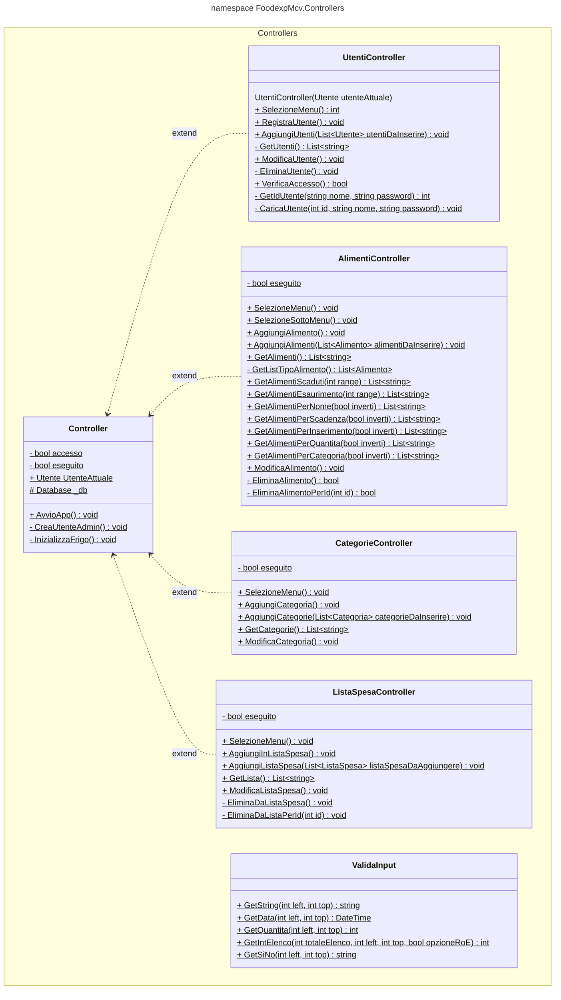

# Cartella Controllers

La cartella "Controllers" contiene le classi che gestiscono il flusso di controllo dell'applicazione e coordinano le interazioni tra le view e i modelli.  
Queste classi implementano le operazioni CRUD (Create, Read, Update, Delete) per manipolare i dati dell'applicazione.  
Ogni classe controller è responsabile di rispondere alle richieste dell'utente provenienti dall'interfaccia utente o da altre fonti e di orchestrare le azioni necessarie per elaborare queste richieste.  
All'interno delle classi controller, vengono implementati metodi che corrispondono alle operazioni CRUD, come il recupero dei dati (Read), l'inserimento di nuovi record (Create), la modifica dei record esistenti (Update) e la rimozione dei record (Delete).  
Le classi svolgono un ruolo chiave nella gestione dell'interazione dell'utente con l'applicazione, nella definizione della logica di business e nell'elaborazione delle operazioni fondamentali per la gestione dei dati.

## UML CLASSI

