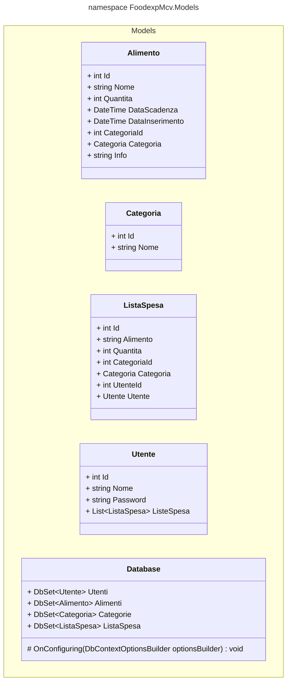

# Cartella Models

La cartella "Models" contiene le classi che definiscono i modelli dei dati utilizzati dall'applicazione.  
Questi modelli rappresentano le entità principali con cui l'applicazione interagisce e sono fondamentali per la gestione e la manipolazione dei dati.  
Ogni classe modello contiene una serie di proprietà che rappresentano gli attributi e i dati associati all'entità che il modello rappresenta.  
I modelli sono utilizzati in varie parti dell'applicazione, inclusi i controller per elaborare le richieste, le view per visualizzare i dati e qualsiasi altra logica di business che coinvolge la gestione dei dati.

## UML CLASSI

