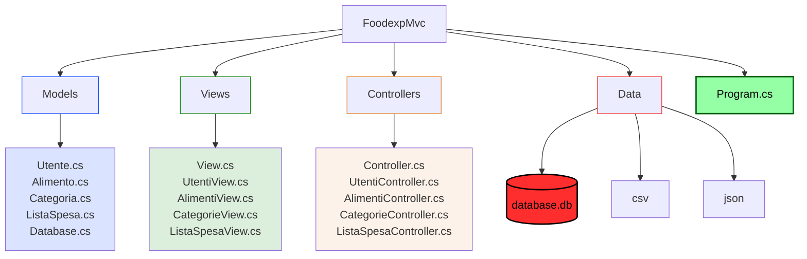
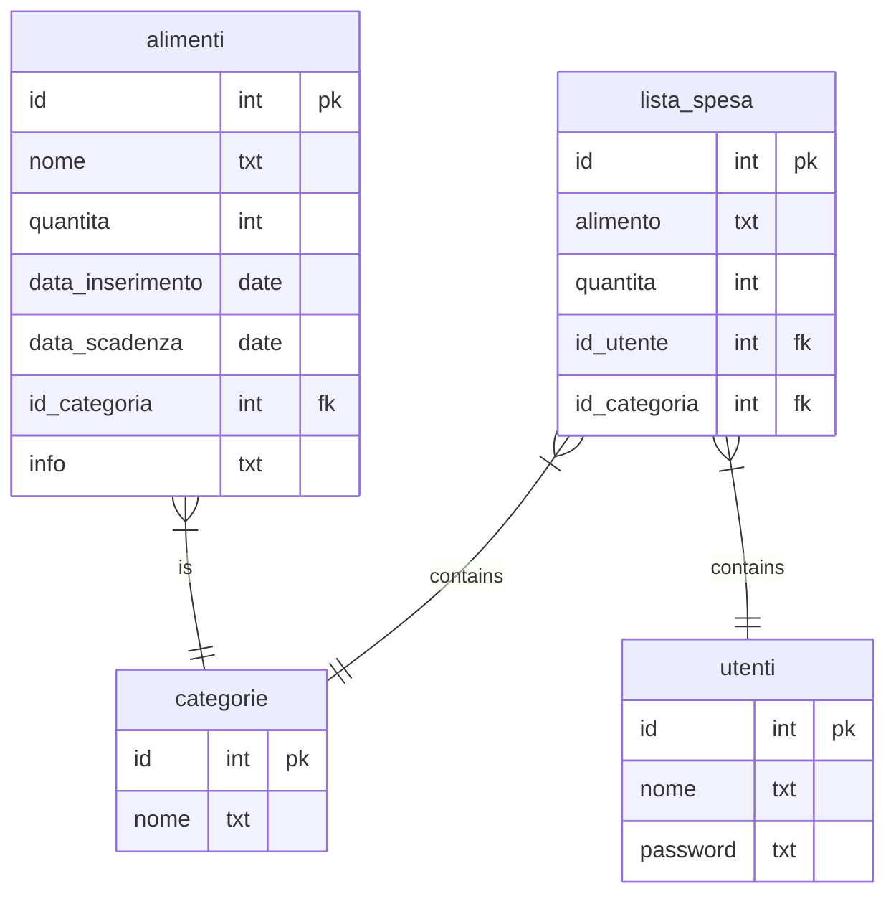

# PROGETTO FOODEXP

Applicazione *console* che tiene traccia degli alimenti inseriti in un frigorifero gestito da più utenti, verifica la data di scadenza di ogni alimento e memorizza la quantità in giacenza.  
L'applizazione avvisa l'utente in caso di alimenti scaduti o in esaurimento (ad esempio se ne rimane solo 1) e pemette la creazione di una lista della spesa comune con l'inserimento di alimenti per ogni utente.

## PUBBLICO TARGET
- L'applicazione è pensata per chiunque possieda/gestisce un frigorifero.

## DEFINIZIONE DEI REQUISITI E ANALISI
- [x] L'applicazione utilizza un sistema di autenticazione **nome utente/password** per l'accesso.
- L'applicazione deve poter gestire gli **accessi illegali** da parte di utenti no accreditati.
- [x] L'applicazione deve consentire all'utente di **inserire**, **modificare**, **eliminare** il proprio nome utente e/o la password di accesso.
- [x] L'applicazione deve consentire all'utente di **inserire**, **modificare**, **eliminare** un alimento da tastiera.
- [x] L'applicazione deve consentire all'utente di **inserire**, **modificare**, **eliminare** un prodotto dalla lista della spesa comune.
- [x] L'applicazione deve consentire all'utente di **visualizzare** lo stato degli alimenti nel frigo sotto forma di elenco numerato e colorato a seconda se il prodotto è scaduto (rosso) oppure se in esaurimento (magenta).
- [x] L'applicazione deve consentire all'utente di **filtrare** e **visualizzare** gli alimenti scaduti, prossimi alla scadenza (entro 1 giorno) e in esaurimento (quantità 1). 
- [x] L'applicazione deve consentire all'utente di **visualizzare** la lista della spesa sotto forma di elenco numerato.
- [x] L'applicazione deve consentire all'utente di **visualizzare** l'elenco di tutti gli utenti inseriti.
- [x] L'applicazione deve poter gestire tutti gli errori in fase di inserimento da tastiera (date errate, quantità errate, nomi o descrizioni vuote), informado l'utente con messaggi chiari e colorati (rosso).
- [x] L'applicazione deve poter gestire i conflitti con l'**inserimento di uno stesso alimento** con stessa data di scadenza (incremento di quantità) oppure con data di scadenza differente (inserimento di più alimenti con lo stesso nome).

## PIANIFICAZIONE E DESIGN DELL'ARCHITETTURA

- [x] Applicazione modellata secondo il pattern MVC suddivisa nelle cartelle seguenti:
> - Models
> - Views
> - Controllers
>
> Struttura dell progetto

- [x] Interfaccia utente da riga di comando CLI.
- [x] Creazione e gestione del database mediante il package **EntityFramework**.
- [ ] Migrazione del database con **SQLite**.
- [ ] Migrazione del database con **MariaDB**. 
- [x] L'applicazione utilizza un database per la memorizzazione dei dati utilizzando 4 tabelle:
> - Utenti
> - Alimenti
> - Categorie
> - ListaSpesa  
>  
> Struttura del database `database.db`

- [ ] L'applicazione deve poter leggere un elenco di alimenti da file **csv**.
- [ ] L'applicazione deve poter memorizzare gli alimenti e gli utenti in file **JSON**.
- [x] L'applicazione utilizza i colori per la gestione dell'output da console.

### Menu applicazione console
> **Login**
> - 1.Accedi
> - e.Esci

> **Schermata iniziale**
> - 1.Frigorifero
> - 2.Filtra alimenti
> - 3.Gestisci alimenti
> - 4.Gestisci categorie
> - 5.Gestisci utenti
> - e.Esci

> **Filtra alimenti**
> - 1.Visualizza tutti
> - 2.Visualizza scaduti
> - 3.Visualizza in scadenza
> - 4.Visualizza in esaurimento
> - 5.Ordina per nome
> - 6.Ordina per data di scadenza
> - 7.Ordina per data di inserimento
> - 8.Ordina per quantità
> - 9.Ordina per categoria
> - r.Torna al menu principale

> **Gestisci alimenti**
> - 1.Inserisci alimento
> - 2.Modifica alimento
> - 3.Elimina alimento
> - r.Torna al menu principale

> **Gestisci categorie**
> - 1.Visualizza categorie
> - 2.Modifica categoria
> - 3.Elimina categoria
> - r.Torna al menu principale

> **Gestisci utenti**
> - 1.Visualizza utenti
> - 2.Modifica password
> - 3.Elimina account
> - r.Torna al menu principale

## DEFINIZIONE DI STRUTTURE E CONVENZIONI

- [x] I nomi dei **namespace** devono essere PascalCase.
- [x] I nomi delle **classi** devono essere PascalCase.
- [x] I nomi dei **metodi** devono essere PascalCase.
- [x] I nomi delle **variabili** devono essere camelCase.
- [x] I nomi delle **costanti** devono essere SNAKE_UPPERCASE.
- [x] I nomi dei **file** devono essere camelCase.
- [x] I nomi delle **cartelle** MVC e Data devono essere PascalCase.
- [ ] I nomi dello **schema** sql devono essere snake_case.

## SVILUPPO DEI COMPONENTI

- [x] Creare un progetto applicazione console.
- [ ] Creare un progetto applicazione web.
- [ ] Creare un progetto di test per i test unitari.

## TEST E DEBUGGING

- [ ] Scrivere test unitari per i componenti dell'applicazione.
- [ ] Eseguire il debugging per individuare e risolvere i bug.

## DOCUMENTAZIONE

- [x] Documentare il codice e l'architettura dell'applicazione.
- [ ] Documentare i test unitari.
- [ ] Documentare la fase di Beta Testing.
- [ ] Documentare la fase di post Beta Testing.