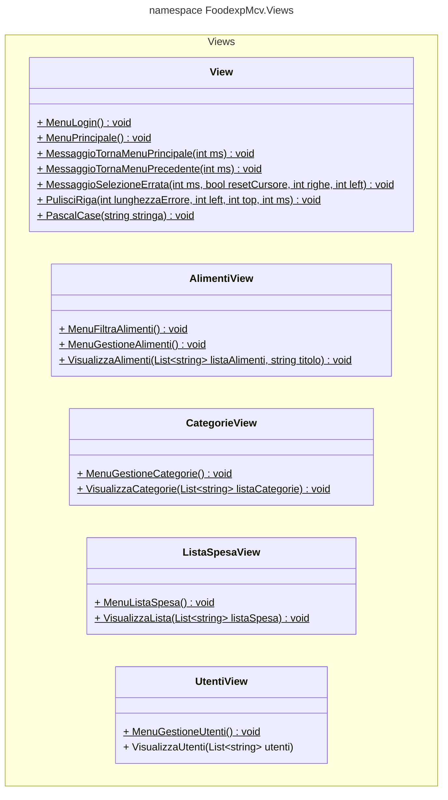

# Cartella Views

La cartella "Views" contiene le classi o i metodi che rappresentano l'interfaccia utente testuale dell'applicazione console.  
Le view sono responsabili di mostrare i dati provenienti dal modello e di presentarli in modo comprensibile all'utente attraverso il terminale o la console. All'interno di questa cartella, le view sono organizzate in modo logico e rappresentano le diverse schermate o interfacce utente dell'applicazione.  
Ogni view può includere output di testo formattato, interazioni con l'utente tramite input da tastiera e visualizzazione di dati dinamici. Le view possono utilizzare metodi per gestire l'interazione con l'utente e per eseguire azioni specifiche basate sui dati forniti.  
Le view sono strettamente integrate con i controller e possono ricevere dati da essi per personalizzare la visualizzazione dei dati in base alle esigenze dell'applicazione.

## UML CLASSI

