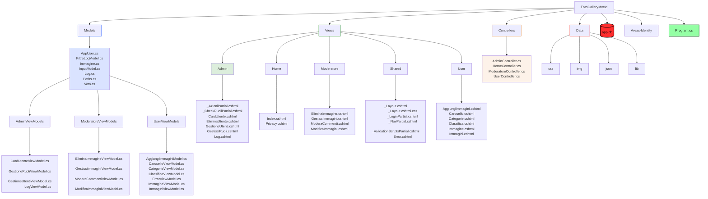
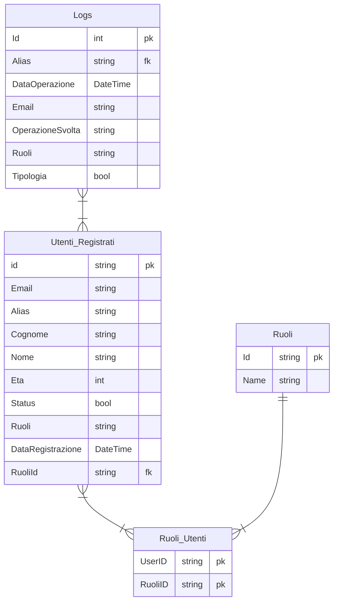
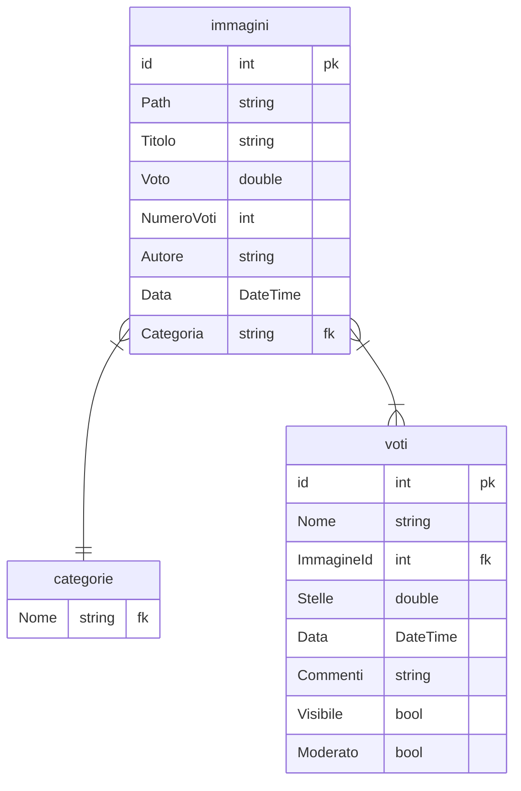

# FOTOGALLERY RAZOR

Applicazione web di tipo "photogallery" che prevede l'iscrizione al sito come:  
- utente "User" per l'utilizzo "consumer", inserimento immagini, vota e commenta immagine;  
- utente "Moderatore" per la gestione delle imamgini inserite e dei commenti da approvare o censurare;
- utente "Admin" per la gestione degli utenti e l'assegnazione dei vari ruoli. 

Sezioni "User" del sito web: 

- Home: presenterà una serie di immagini disposte su griglia con media voto e icona stella, pulsante aggiungi che reindirizza alla pagina di aggiunta immagine, pulzante categorie per selezionare la categoria, pulsante play che avvia un carosello di immagini.  
- Cliccando sull'immagine si verrà reindirizzati al dettaglio dell'immagine che conterrà l'autore dell'imaggine, la data di pubblicazione, la media voti con stelle da 1 a 5 e i vari commenti degli utenti.  
I commenti degli utenti verranno visualizzati sotto forma di nome utente, numero di stelle assegnate e commento (se non moderato verrà visualizzato come "in attesa di moderazione", se censurato "commento censurato").  
- Categorie: i link alle categorie sotto foma di card per la selezione delle categorie.
- Classifica: l'elenco di tutte le immagini in forma tabellare ordinabili per titolo, autore, data di pubblicazione e voto. Cliccando sull'immagine si apre una modale a schermo grande con possibilità di accedere al dettaglio dell'immagine.
- Aggiungi: sezione che permette di aggiungere le immagini con conferma di aggiunta.

Sezioni "Moderatore" del sito web: 
- Gestisci: sezione che permette di aggiungere, modificare e eliminare le immagini, con tabella ordinabile per id, titolo, autore e data di pubblicazione.
- Modera: sezione che permette di approvare o censurare i commenti degli utenti, con tabella ordinabile per id, utente, commento (per commenti lunghi il testo è cliccabile aprendo una modale), data inserimento.

Sezioni "Admin" del sito web: 
- Utenti: sezione per la gestione degli utenti, possibilità di bloccare un utente, di asssegnare ruoli, di eliminare utenti. In forma tabellare ordinabile per id, alias, ruoli, email, status.  
- Cliccando sull'alias si verrà reindirizzati al profilo dell'utente con tutte le informazioni personali e la possibilità di bloccare, assegnare ruoli e eliminare l'utente.  
- Log: sezione dedicata ai log di sistema con possibilità di ordinare e filtrare per id, data, email, alias, ruolo, operazione e tipologia.

## PUBBLICO TARGET  
- L'applicazione è pensata per utenti con erà maggiore di 18 anni.  

## DEFINIZIONE DEI REQUISITI E ANALISI  
- [x] L'applicazione permette all'utente di inserire nome, voto e commento una sola volta per ogni immagine. 
- [x] L'applicazione permette all'amministratore di moderare i commenti.
- [x] L'applicazione permette all'utente di visualizzare tutte le immagini disposte in griglia.
- [x] L'applicazione permette all'utente di visualizzare ogni singola immagine con i dettagli.
- [x] L'applicazione permette all'utente di visualizzare la classifica delle immagini. 

## PIANIFICAZIONE E DESIGN DELL'ARCHITETTURA  

- [x] Applicazione MVC suddivisa nelle cartelle seguenti:
> - Models
> - View
> - Controllers
> - wwwroot
> - Data
> - Areas
>
> Struttura dell progetto (verranno indicati solo le cartelle o i file modificati):

- [x] L'applicazione utilizza un db sqlite con EntityFrameworw per la memorizzazione dei dati (password presenti nel file **password.txt**):
> - Utenti Registrati (AspNetUsers)
> - Ruoli (AspNetRoles)
> - Ruoli Utenti (AspNetUserRoles)
> - Logs

> Struttura relazionale app.db (versione semplificata con i soli campi fondamentali):

- [x] L'applicazione utilizza file json per la memorizzazione dei dati:
> - categorie.json
> - immagini.json
> - voti.json

> Struttura relazionale dei file json:

Il file **immagini** conterrà:
- Id: numero identificativo univoco dell'immagine
- Path: percorso dell'immagine
- Titolo: breve descrizione dell'immagine
- Voto: media dei voti utenti
- Autore: chi ha pubblicato
- Data: data di pubblicazione immagine
- Categoria: categoria di appartenenza dell'imamgine

Il file **voti** conterrà:
- Id: numero identificativo univoco dell'utente
- Nome: il nome dell'utente
- ImmagineId: numero identificativo univoco dell'immagine
- Stelle: voto da 1 a 5
- Data: data di pubblicazione del commento
- Commento: breve commento dell'utente
- Visibile: valore booleano gestito dal moderatore che setta il commento su visibile o nascosto
- Moderato: valore booleano gestito dal moderatore che setta il commento come processato 

Il file **categorie** conterrà le seguenti 6 categorie (con possibilità di aggiunte future):
> - Paesaggi
> - Sport
> - Cibo
> - Persone
> - Oggetti
> - Animali

## DEFINIZIONE DI STRUTTURE E CONVENZIONI

- [x] I nomi dei **namespace** devono essere PascalCase.
- [x] I nomi delle **classi** devono essere PascalCase.
- [x] I nomi dei **metodi** devono essere PascalCase.
- [x] I nomi delle **variabili** devono essere camelCase.
- [x] I nomi delle **costanti** devono essere SNAKE_UPPERCASE.
- [x] I nomi dei **file** devono essere camelCase.
- [x] I nomi delle **cartelle** MVC e Data devono essere PascalCase.
- [x] I nomi dei file **immagini** devono essere snake_case.
- [ ] I nomi dello **schema** sql devono essere snake_case.

## SVILUPPO DEI COMPONENTI

- [ ] Creare un progetto applicazione console.
- [x] Creare un progetto applicazione web.
- [ ] Creare un progetto di test per i test unitari.

## TEST E DEBUGGING

- [ ] Scrivere test unitari per i componenti dell'applicazione.
- [ ] Eseguire il debugging per individuare e risolvere i bug.

## DOCUMENTAZIONE

- [x] Documentare il codice e l'architettura dell'applicazione.
- [ ] Documentare i test unitari.
- [ ] Documentare la fase di Beta Testing.
- [ ] Documentare la fase di post Beta Testing.