# BETA TEST TRACCIA ALIMENTI FRIGORIFERO

## OBIETTIVI

Testare il programma, segnalare eventuali bug, consigli e spunti sull'user experience.
- Eccezioni:
  >prova bene tutte le eccezioni possibili;  
   inserire stringhe al posto di numeri;  
   provare numeri troppo grandi;  
   inserire date inesistenti.
- Gestione dei file: 
  >verificare la corretta esecuzione di import o export dei file csv;  
   la manipolazione dei JSON da parte dell'applicazione come creazione, modifica, eliminazione.

### PROBLEMI IGNOTI:
Controllare problema **"x"** che non sono riuscito a risolvere o a notare.

### USER EXPERIENCE:
- Hai suggerimenti per migliorare l'esperienza dell'utente su questo programma?
- Come valuti l'usabilità e la chiarezza dei menu?
- I colori utilizzati nei messaggi all'utente sono leggibili?

## POST BETA TEST:

  
 Raccolta feedback 

  

    
 Feedback di Dylann 

>  **Eccezioni**

- [x] stringhe
- [x] data inserita
- [x] quantita inserita

>  **Bug**
- [x] in "Visualizza alimenti" compare "premi invio..." ma si può premere qualsiasi tasto
- [x] se il frigo è vuoto non compare la scritta "premi..."
- [x] se nella cartella temp c'è gia un file csv non ne salva un altra
- [ ] se inserisco un csv non formattato non mi segnala alcun errore

>  **Miglioramenti**

- [x] esplicitare all'utente che il csv verrà importato da altra app esterna

  

Priorità
1. Gestione file csv
2. Fix messaggi grafici
3. Messaggio di avviso per l'utente di import csv da altra app.
## Tempistica di sviluppo

```mermaid
gantt
    title Tempistiche
    dateFormat  HH:mm
    axisFormat %H:%M
    section Bug
    Csv       :crit, done, a1, 11:30 , 30m
    section Miglioramenti
    Fix messaggi video      :done, a2, after a1, 30m
    Messaggio di avviso gestione csv       :done, after a2, 30m

```

