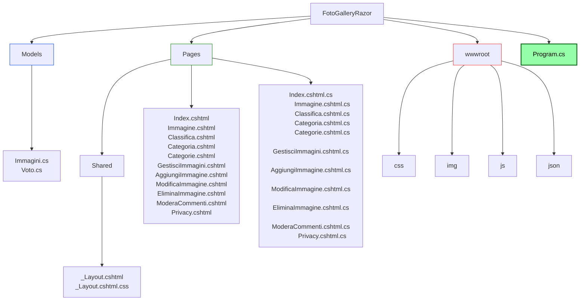
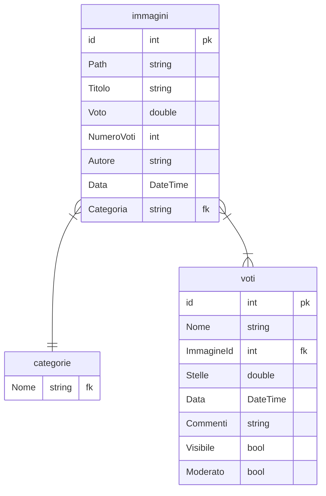

# FOTOGALLERY RAZOR

Applicazione razor per la creazione di un sito web di tipo photogallery con la possibilità da parte degli utenti di inserire voti da 1 a 5 stelle e commenti moderati dall'amministratore.  
La home page presenterà una serie di immagini disposte su griglia con media voto e icona stella. Cliccando sull'immagine si verrà reindirizzati al dettaglio dell'immagine che conterrà l'autore dell'imaggine, la data di pubblicazione, la media voti con stelle da 1 a 5 e i vari commenti degli utenti.  
I commenti degli utenti verranno visualizzati sotto forma di nome utente, numero di stelle assegnate e commento (se moderato verrà censurato.  
Nel sito saranno presenti anche le seguenti sezioni:
- Categorie: i link alle categorie che porteranno ad un carosello delle immagini.
- Classifica: l'elenco di tutte le immagini in forma tabellare ordinabili per commento.
- Gestisci: sezione che permette di aggiungere, modificare o cancellare le immagini.
- Moderatore: sezione che permette di approvare o censurare i commenti degli utenti.

## PUBBLICO TARGET  
- L'applicazione è pensata per tutti.  

## DEFINIZIONE DEI REQUISITI E ANALISI  
- [x] L'applicazione permette all'utente di inserire nome, voto e commento una sola volta per ogni immagine. 
- [x] L'applicazione permette all'amministratore di moderare i commenti.
- [x] L'applicazione permette all'utente di visualizzare tutte le immagini disposte in griglia.
- [x] L'applicazione permette all'utente di visualizzare ogni singola immagine con i dettagli.
- [x] L'applicazione permette all'utente di visualizzare la classifica delle immagini. 

## PIANIFICAZIONE E DESIGN DELL'ARCHITETTURA  

- [x] Applicazione Razor suddivisa nelle cartelle seguenti:
> - Models
> - Pages
> - wwwroot
>
> Struttura dell progetto (verranno indicati solo le cartelle o i file modificati):

- [x] L'applicazione utilizza file json per la memorizzazione dei dati:
> - immagini.json
> - voti.json
> - categorie.json

> Struttura relazionale dei file json:

Il file **immagini** conterrà:
- Id: numero identificativo univoco dell'immagine
- Path: percorso dell'immagine
- Titolo: breve descrizione dell'immagine
- Voto: media dei voti utenti
- Autore: chi ha pubblicato
- Data: data di pubblicazione immagine
- Categoria: categoria di appartenenza dell'imamgine

Il file **voti** conterrà:
- Id: numero identificativo univoco dell'utente
- Nome: il nome dell'utente
- ImmagineId: numero identificativo univoco dell'immagine
- Stelle: voto da 1 a 5
- Data: data di pubblicazione del commento
- Commento: breve commento dell'utente
- Visibile: valore booleano gestito dal moderatore che setta il commento su visibile o nascosto
- Moderato: valore booleano gestito dal moderatore che setta il commento come processato 

Il file **categorie** conterrà le seguenti 6 categorie (con possibilità di aggiunte future):
> - Paesaggi
> - Sport
> - Cibo
> - Persone
> - Oggetti
> - Animali

## DEFINIZIONE DI STRUTTURE E CONVENZIONI

- [x] I nomi dei **namespace** devono essere PascalCase.
- [x] I nomi delle **classi** devono essere PascalCase.
- [x] I nomi dei **metodi** devono essere PascalCase.
- [x] I nomi delle **variabili** devono essere camelCase.
- [x] I nomi delle **costanti** devono essere SNAKE_UPPERCASE.
- [x] I nomi dei **file** devono essere camelCase.
- [x] I nomi delle **cartelle** MVC e Data devono essere PascalCase.
- [x] I nomi dei file **immagini** devono essere snake_case.
- [ ] I nomi dello **schema** sql devono essere snake_case.

## SVILUPPO DEI COMPONENTI

- [ ] Creare un progetto applicazione console.
- [x] Creare un progetto applicazione web.
- [ ] Creare un progetto di test per i test unitari.

## TEST E DEBUGGING

- [ ] Scrivere test unitari per i componenti dell'applicazione.
- [ ] Eseguire il debugging per individuare e risolvere i bug.

## DOCUMENTAZIONE

- [x] Documentare il codice e l'architettura dell'applicazione.
- [ ] Documentare i test unitari.
- [ ] Documentare la fase di Beta Testing.
- [ ] Documentare la fase di post Beta Testing.