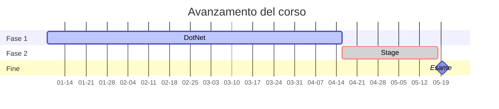

# Corso di programmazione dotNet 2024
<!-- ******************************************  grafico gantt   ****************************************** -->


<small>Lezioni seguite  ✔️. Lezioni perse in ❌. Lezioni annullate ⚠️
</small>  

<!-- ******************************************  08 gen 2024   ****************************************** -->
<details>
    <summary><h3>08 gen 2024 ✔️</h3></summary>

Breve introduzione al corso, presentazione dei colleghi. Raccolta del materiale su github.  

Argomenti:
- Installare l'ambiente di lavoro sul pc (VSCode, Git, SDK.net, estensioni VSCode).
- Registrazione su ***github.com*** e prime basi sul versionamento del codice.
- Primi comandi da terminale: git e dotnet.
- Creazione token gitub.
- Creazione prima app da console dotnet.
- Creazione ambiente di lavoro e creazione primo repository.
- Creazione primo file README.md e breve introduzione al Markdown.

### Info
> Password pc 'aula'. Password admin '!Aula'.  
> Estensioni VSCode: C# Dev Kit, Intellicode for C#, C# Snippets, Italiano pack.

### 💡 Tip
Domande da fare per i colloqui aziendali:
>1. *Utilizzate JS per il vostro tipo di lavoro?*
>2. *QUale hub utilizzate per il versionamento?*
>3. *Utilizzate BootStrap o TailWind?*
>4. *Utilizzate DB relazionali o a documenti (MongoDB)*

### Note
- Primi comandi **git** utilizzati:

```sh
    $ git                        # lista di comandi
    $ git --version              # versione installata
    $ git auth login             # per accedere a git
    $ git init                   # inizializza il repository
    $ git log                    # visualizza lista dei commit
    $ git status                 # viualizza lo stato del repository
    $ git add                    # aggiunge i file allo stage
    $ git commit -m "mess"       # esegue il commit 
    
```
- Primi comandi **dotnet** utilizzati:

```sh
    $ dotnet --version           # versione installata
    $ dotnet new                 # visualizza opzioni di creazione nuovo progetto
    $ dotnet new console         # creo nuovo progetto di app console (da terminale)
    $ dotnet new webapp          # creo nuovo progetto di app web (sito web)
    
```
</details>

<!-- ******************************************  09 gen 2024   ****************************************** -->
<details>
    <summary><h3>09 gen 2024 ✔️</h3></summary>

Argomenti:
- Dichiarare variabili *string*, *int*, *bool*, *double*.
- Utilizzo oggetto di tipo **data**.
- Operazioni tra numeri int, double.
- Operatori di confronto "==", "!=", "<", ">".
- Come si cancella ultimo commit.
- Utilizzo del comando `git log` per visualizzare la history dei commit.


### Info
> Utilizzo dei **backtick** `````` per l'inserimento di linee di codice nella documentazione.  
> Ricreare il file *sln* con il comando `dotnet new sln`.

### Note
- Procedura di invio commit:

```sh
    git add #[nomeFile.ext]
    git commit -m "Messaggio del commit"
    git push -u origin main     #origin = indirizzo del server; 
                                #main = il branch attuale

```
### :white_check_mark: Commit program status
- Inseriti commit da **n.1** a **n.12**

</details>

<!-- ******************************************  10 gen 2024   ****************************************** -->
<details>
    <summary><h3>10 gen 2024 ⚠️</h3></summary>

> :information_source: **Info**  
> Lezione annullata!!!  

### Note
Prove di versionamento da casa su pc window e mac.

</details>

<!-- ******************************************  11 gen 2024   ****************************************** -->
<details>
    <summary><h3>11 gen 2024 ✔️</h3></summary>

Argomenti:
- Dichiarare array di tipo *string* e di tipo *int*.
- Utilizzare i metodi degli array.
- Dichiarare lista di string e di int con la classe *List*.
- Utilizzare i metodi della classe List.
- Dichiarare una pila di string con la classe *Stack*.
- Dichiarare una coda di string con la clase *Queue*.
- Riordino di una lista con il metodo *Sort*.
- Jetbrains.com.

### Info
> Risolvere il problema dell'autocompletamento IntelliCode.

### Note
- Rimuovere i file appena aggiunti allo stage di git.

```sh
    git restore --staged "path del file"    #rimuove il file dallo stage
```

### :white_check_mark: Commit program status
- Inseriti commit da **n.13** a **n.22**

</details>

<!-- ******************************************  12 gen 2024   ****************************************** -->
<details>
    <summary><h3>12 gen 2024 ✔️</h3></summary>

Argomenti:
- Istruzioni di controllo *if*, *switch*, *for*, *while*.
- Creare dizionari "chiave, valore" con la classe *Dictionary*.
- Utilizzare i metodi di Dictionary.
- Utilizzare il metodo *foreach* per leggere liste, array, dictionary, code, stack.

### Note
- Visualizzare i key di un dictionary e stamparli a video con il metodo `oggetto.Keys`:

```c#
    //creo oggetto dizionario di tipo <string,string>
    Dictionary<string, string> nomi = [];
    //aggiunto 3 valori
    nomi.Add("Ussi", "Simone");
    nomi.Add("Ussi", "Fabio");
    nomi.Add("Gigante", "Emanuela");
ƒ
    foreach (string cognome in nomi.Keys)
    {
        Console.WriteLine(cognome);
    }
```

### :white_check_mark: Commit program status
- Inseriti commit da **n.23** a **n.33**

</details>

<!-- ******************************************  15 gen 2024   ****************************************** -->
<details>
    <summary><h3>15 gen 2024 ✔️</h3></summary>

Argomenti:
- Creare menu di selezione per input da console.
- Utilizzo della classe *ConsoleKeyInfo* per la gestione dei tasti premuti in input da tastiera.
- Creazione del file **.gitignore**.
- Drag & Drop di un file di testo nel terminale.

### Note
- Premi il tasto `N` per terminare l'esecuzione.  
Possibile soluzione :

```c#
    //output per l'utente
    Console.WriteLine("Premi 'N' per terminare...");

    //ciclo che termina quando si preme il tasto corretto
    while (true)
    {   
        //creo oggetto keyInfo che memorizza il tasto premuto
        ConsoleKeyInfo keyInfo = Console.ReadKey();
        if (keyInfo.Key == ConsoleKey.N) //confronto con il tasto N
        {
            return; // esce dal programma se viene premuto N
        }  
    }
```

### :white_check_mark: Commit program status
- Inseriti commit da **n.34** a **n.41**

</details>

<!-- ******************************************  16 gen 2024   ****************************************** -->
<details>
    <summary><h3>16 gen 2024 ✔️</h3></summary>

Argomenti:
- Metodo ***asincrono*** per creare un timeout di input.
- Metodo normale per creare un timeout di input.

### Info
> Creata lista della spesa nel programma con selezione multipla.
> Per utilizzare i metodi asincroni dobbiamo cambiare la definizione del main da `void` a `async Task`.

### :white_check_mark: Commit program status
- Inserito commit **n.43**

</details>

<!-- ******************************************  17 gen 2024   ****************************************** -->
<details>
    <summary><h3>17 gen 2024 ✔️</h3></summary>

Argomenti:
- Generare numeri random con la classe *Random*
- Cambiare i colori di output della console.
- Fizz Buzz.
- Accenno funzione *Lambda*.

### Info
> Cambiato lo snippet `cw` e personalizato.
> Provata una creazione di matrice 2x2.
> .... 

### Note
- Per cambiare colore del carattere dell'output da console usare `ForegroundColor`:

```c#
    //cambio il colore del testo 
    Console.ForegroundColor = ConsoleColor.DarkCyan;
    Console.WriteLine(cognome);
    //ripristino il colore di default
    Console.ResetColor();
```

- Per cambiare colore del carattere dell'output da console usare `BackgroundColor`:

```c#
    //cambio il colore dello sfondo 
    Console.BackgroundColor = ConsoleColor.DarkCyan;
    Console.WriteLine(cognome);
    //ripristino il colore di default
    Console.ResetColor();
```

### :white_check_mark: Commit program status
- Inseriti commit da **n.44** a **n.51**

</details>


<!-- ******************************************  18 gen 2024   ****************************************** -->
<details>
    <summary><h3>18 gen 2024 ✔️</h3></summary>

Argomenti:
- Creazione prima calcolatrice.
- Utilizzare le etichette nel codice per il comando "goto"
- Gestire le lingue 'CurrentCulture'
- Gestire il punto o la virgola in inserimento double
- Gestire l'output dei decimali 
- Bitwise operator
- Programma che genera un numero random e chiede di indovinare il numero

### Info
>Utilizziamo il costrutto switch.  
>Verifichiamo l'input inserito, deve essere di tipo intero.  
>Controlla che lo zero non sia inserito nella divisione.  
>Prova le due versioni.  
>Utilizza i double.

### Note
- attenzione a come si scrive il numero double (virgola o punto).
Possibile soluzione:

```c#
    double a = double.Parse(Console.ReadLine()!.Replace(".",","));
```

- nascondere il tasto premuto da console

```c#
    // inserisci senza che si vede il tasto sullo schermo
    ConsoleKeyInfo key = Console.ReadKey(true);
    string selezione = key.keyChar.ToString();
```

### :white_check_mark: Commit program status
- Inseriti commit da **n.52** a **n.55**

</details>

<!-- ******************************************  19 gen 2024   ****************************************** -->
<details>
    <summary><h3>19 gen 2024 ✔️</h3></summary>

Argomenti:
- Indovina il numero con i suggerimenti e 10 tentativi.  
- Implementare e aggiungere altri suggerimenti.
- Implementare un sistema a punteggi con possibilità di creare un nuovo gioco.

### Info
> Indicare se il numero è più basso/alto.  
> Indicare se il numero è pari o dispari.  
> La somma delle cifre è.  
> Il numero inizia con.  
> Inserisci il Thread.Sleep per simulare che sta pensando.  
> Inserisci un ciclo per poter avviare un nuovo gioco.  
> Inserimento di un contatore per i punti.  

### Note
- Utilizza il % e la / per isolare le cifre del numero:
```c#
    primaCifra = x / 10;
    resto = x % 10; // rimane 1 cifra
```
- Utilizza **case** nello switch senza i **break**:
```c#
    ......
    case 7:               // suggerimento se piu alto o piu basso
    case 6:               // per tre volte
    case 5:               // di fila 
    case 3:               // e per il 
    case 2:               // resto dei
    case 1:               // tentativi rimasti

    if (input < x)
    ......
```
- Somma delle cifre di un numero:
```c#
    resto = x;
    while (resto > 0)
    {
        somma += resto % 10;
        resto /= 10;
    }
```

### :white_check_mark: Commit program status
- Inseriti commit da **n.56** a **n.60**

</details>

<!-- ******************************************  22 gen 2024   ****************************************** -->
<details>
    <summary><h3>22 gen 2024 ⚠️</h3></summary>

> :information_source: **Info**  
> Lezione annullata!!!  

### :white_check_mark: Commit program status
- Inserito commit **n.61**

</details>

<!-- ******************************************  23 gen 2024   ****************************************** -->
<details>
    <summary><h3>23 gen 2024 ✔️</h3></summary>

Argomenti:
- Verifica del programma svolto nella lezione precedente
- Gestione degli **errori** e delle **eccezioni**
- Applicare la gestione degli errori ai nostri programmi. 
- Modificata la calcolatrice n.55 con la gestione try-cath.   


### Gestione degli errori e delle eccezioni.  
Try-catch-finally e try-catch-trow-finally. Try-catch-finally di solito usato per la gestione dei database.  
Differenziare gli errori per il programmatore e quelli per l'utente, quindi con la gestione di essi semplifico l'usabilità dei programmi.  

### Info
> Potrei implementare i colori nel codice.  
> Programmino per insegnare la matematica ai bambini e ai DSA.  
> Modifica il Diario, inserisci una batteria con il % che indica il livello del corso.  

### Note 
- Controlla l'input del numero quando seleziono il numero di tentativi. I caratteri non devono essere ammessi.    
Possibile soluzione: 

```c#
    ............
    case "d":
    InputD:
        Console.WriteLine("Scegli il numero di tentativi (max 10).");
        input = Console.ReadLine()!;
        
        try     // gestione errore carattere inserito al posto di un int
        {
            maxTentativi = int.Parse(input);                
        }
        catch 
        {
            Console.WriteLine("Devi inserire un numero valido.");
            goto InputD;   
        }
    ............
```

- Potrei utilizzare un bool di debug per il controllo del codice  
Possibile soluzione:

```c#
    // all'inizio del programma
    bool debug = false;
    
    // quando mi serve utilizzarlo
    if (debug)
    {
        // esegui l'azione da controllare
    }
```

- Verificare il max numero possibile per int o per indice array.  
Codice:

```c#
    // visualizza il max numero per int
    int max = int.MaxValue;

    // visualizzare il max indice per un array
    int maxArray = Array.MaxLength

```

### :white_check_mark: Commit program status
- Inseriti commit da **n.62** a **n.70**

</details>

<!-- ******************************************  24 gen 2024   ****************************************** -->
<details>
    <summary><h3>24 gen 2024 ✔️</h3></summary>

Argomenti:
- Finire le modifiche della gestione errori (lezione precedente).  
- Introduzione al beta-test
- Eseguire beta-test del programma del collega.
- Eseguire il post-beta testing.


### Info
> Creazione file README.md per la gestione dei BETA-TEST.  
> Consiglio di utilizzare Jira Software o Trello.

### Note
- Eseguire la radice N-esima di un numero negativo con la funzione **Math.Pow(double, double)**. Con esponente pari la radic di un numero negativo nonesiste, mentre con esponente dispari si e corrisponde alla radice del numero positivo e poi cambiata di segno.  
Esempio: radice 3a di 8 = 2; radice 3a di -8 = -2.  
Possibile soluzione 1:

```c#
    static void Main(string[] args)
    {
        double expRad = 3;
        double exp = 1.0 / expRand;
        double n = -8;
        int segno = 1;
        if (n < 0)
        {
            if (expRad % 2 == 0)
            {
                Console.WriteLine("Operazione impossibile");
                return;
            }
            else
            {
                segno = -1;
                n *= segno;
            }
        }
        double risultato = Math.Pow(n, exp);
        n *= segno;
        risultato *= segno;
        Console.WriteLine($"Radice {expRad} di {n} = {risultato}");
        
    }
```

### :white_check_mark: Commit program status
- Inseriti commit da **n.71** a **n.72**

</details>

<!-- ******************************************  25 gen 2024   ****************************************** -->
<details>
    <summary><h3>25 gen 2024 ✔️</h3></summary>

Argomenti:
- Creazione documentazione beta-test e post beta-test.
- Introduzione ai grafici [**Mermaid**](https://jojozhuang.github.io/tutorial/mermaid-cheat-sheet/).
- Persistenza dei dati con la gestione dei file, txt, csv, JSON.
- Accenno ai database: DB relazionali, DB non relazionali, Entity Framework.
- Accenno alle *Lambda Function*.

### Info
> Installata estenzione "Github Markdown Preview" per visualizzare i file .md in modo corretto.

### Note
- Utilizza il metodo Array.Copy
esempio

```c#
    .......
    string[] lines = File.ReadAllLines(path);
    string[] righe = new string[lines.Length];
    
    Array.Copy(lines, righe, lines.Length);
    .......
```

- Utilizzo funzione Lambda
esempio

```c#
    .......
    if (!lines.Any(line => line.StartsWith("a"))) // funzione lambda
    {
        Console.WriteLine("Nessun nome trovato");
    }
    .......
    // versione con funzione classica
    .......
    if (!lines.Any(Prova))
    {
        Console.WriteLine("Nessun nome trovato");
    }
    // funzione 
    static bool Prova(string s)
    {
        return s.StartsWith("a");
    }
```

### :white_check_mark: Commit program status
- Inseriti commit da **n.73** a **n.80**

</details>

<!-- ******************************************  26 gen 2024   ****************************************** -->
<details>
    <summary><h3>26 gen 2024 ✔️</h3></summary>

Argomenti:
- Utilizzo, creazione, gestione dei *file*.
- Implementa la gestione dei file nel gioco *indovina il numero THE GAME*.

### Info
> Salva il punteggio ad ogni sessione di gioco in modo cumulativo.  

### Note 
- Verificare se un giocatore è gia nel file  

Possibile soluzione :

```c#
    //mi copio il file su un array di string   
    string[] listaGiocatori = File.ReadAllLines(path);
    // verifico se è un nuovo giocatore
    if (!listaGiocatori.Any(linea => linea.StartsWith(nomeGiocatore)))
    .....
```
- Utilizzare il carattere `^` per poter poter selezionare l'indice a partire dall'ultimo
codice:

```c#
    int[] numeri = [0,1,2,3,4,5];
    Console.WriteLine($"{numeri[^2]}"); //visualizza l'indice 4
```

### Note per il Mac
- Utilizza "OpenCore Legacy Patcher" per installare i MacOS più recenti non supportti di default.
- Se si usa *Brew* per cancellare la cache di installazione che si riempie facilmente.
Possibile soluzione 1:

```sh
    brew cleanup  
```

### :white_check_mark: Commit program status
- Inseriti commit da **n.80** a **n.82**

</details>

<!-- ******************************************  29 gen 2024   ****************************************** -->
<details>
    <summary><h3>29 gen 2024 ✔️</h3></summary>

>:warning: Colloquio presso **Nextage** ore 12:00.

Argomenti:
- Progettare un gioco di dati, senza l'utilizzo di classi, metodi e funzioni.  
- Metodologie e best-practices applicate alla creazione di un programma.  
- Esempio di documentazione sulle specifiche.  

### Info
> Creare della documentazione su specifiche del programma e interazione con l'utente.

</details>

<!-- ******************************************  30 gen 2024   ****************************************** -->
<details>
    <summary><h3>30 gen 2024 ✔️</h3></summary>

>:warning: Colloquio presso **Aitek** ore 14:30.

Argomenti:
- Introduzione ai file *csv*.
- Riprendiamo il programma dei dadi.

### Note 
- Per scrivere in un file di testo o visualizzare in output sul terminale, utilizzo un array di string.  
  Si può semplificare l'inizializzazione del suo contenuto nel seguente modo:

```c#
    //metodo classico esteso
    string[] testo = new string[3];
    testo[0] = "Contenuto prima riga";
    testo[1] = "Contenuto seconda riga";
    testo[2] = "Contenuto terza riga";

    //metodo compatto 
    string[] testo = 
    [
        "Contenuto prima riga",
        "Contenuto seconda riga",
        "Contenuto terza riga"
    ]
```

### :white_check_mark: Commit program status
- Inseriti commit da **n.83** a **n.84**

</details>

<!-- ******************************************  31 gen 2024   ****************************************** -->
<details>
    <summary><h3>31 gen 2024 ✔️</h3></summary>

Argomenti:
- Esercitazioni con i file csv.

### Info
> Utilizza l'iterpolazione di stringhe con il carattere `$`.
> Installata estensione per i csv **Rainbow CSV**.

### Note 
- Utilizzata la funzione Lambda

```c#
    if (!File.ReadAllLines(path).Any(riga => riga.StartsWith(nome)))
    //Legge ogni riga del file. Per ogni riga controlla se esiste un 
    //elemento che inizia con il nome selezionato
```
### :white_check_mark: Commit program status
- Inseriti commit da **n.85** a **n.92**

</details>

<!-- ******************************************  01 feb 2024   ****************************************** -->
<details>
    <summary><h3>01 feb 2024 ⚠️</h3></summary>

> :information_source: **Info**  
> Lezione annullata!!!  

</details>

<!-- ******************************************  02 feb 2024   ****************************************** -->
<details>
    <summary><h3>02 feb 2024 ✔️</h3></summary>

Argomenti:
- Funzioni e metodi

### Info
> RIpreso il codice del MiniRisiko

### Note 
- Possiamo usare la *keyword* `ref` nelle funzioni per poter passare il riferimento del parametro, ovvero
  il puntatore stesso di quell'oggetto o variabile.

esempio:

```c#
    static void Main(string[] args)
    {
        int a = 1, b = 3;
        int somma = 0;
    }
    //negli argomenti si utilizza il ref
    static void SommaNumeri(int a, int b, ref int tot)
    {
        tot = a + b;
        Console.WriteLine(tot);
    }
```

### Note 
- Quando creo una funzione, posso inizializzare un argomento nella dichiarazione stessa della funzione

esempio:

```c#
    /*Funzione che stampa un messaggio int volte.
      Nel caso un utente non inserisca il valore, si usa quello di default
    */
    static void Stampa(string messaggio, int volte = 5)
    {
        for (int i = 0; i < volte; i++)
        {
            Console.WriteLine(messaggio);
        }
    }
```


### :white_check_mark: Commit program status
- Inseriti commit da **n.93** a **n.95**

</details>

<!-- ******************************************  05 feb 2024   ****************************************** -->
<details>
    <summary><h3>05 feb 2024 ✔️</h3></summary>

Argomenti:
- Persistenza dei file con il formato *JSON*, per gestire più livelli di informazione.
- Json: crare, leggere, modificare, copiare su csv.
- Crare nuovo progetto: TracciaAlimentiFrigorifero.

### Info
> JSON deve essere formattato in un certo modo.
> Dobbiamo prima importare il pacchetto **NuGet Newtonsoft.Json**.
> Non li posso trattare nativamente, ma dobbiamo importare una libreria con lo **using**.

### Note 
- Importare il pacchetto NuGet Newtonsoft.Json da terminale nella directory del programma dove lo vogliamo utilizzare.  
  Ua volta importato, il file progetto.csproj conterrà il codice con le sue dipendenze JSON.

```sh
    dotnet add package Newtonsoft.Json
```
```c#
    using Newtonsoft.Json;
```

### :white_check_mark: Commit program status
- Inseriti commit da **n.96** a **n.101**

</details>

<!-- ******************************************  06 feb 2024   ****************************************** -->
<details>
    <summary><h3>06 feb 2024 ✔️</h3></summary>

Argomenti:
- Presentazione documentazione dei nostri progetti sull'utilizzo dei file JSON. 
- Introduzione ASP.NET CORE per full stack in dotnet:
    > Pattern MVC.  
    > Razor e Blazor.  
    > Entity framework e Identity framework.  
    > Docker e Kubernetes.  

</details>

<!-- ******************************************  07 feb 2024   ****************************************** -->
<details>
    <summary><h3>07 feb 2024 ✔️</h3></summary>

Argomenti:
- Finire il programma che utilizza i file JSON.
- Creato repository dei nostri progetti e caricati i files.md.
- Beta-Testing app Dylann.

</details>

<!-- ******************************************  08 feb 2024   ****************************************** -->
<details>
    <summary><h3>08 feb 2024 ✔️</h3></summary>

Argomenti:
- Creare documentazione pre-beta test da inviare al tester.
- Inserire il feedback del tester nella documentazione.
- Eseguire il fix del programma seguendo i feedback raccolti.

</details>

<!-- ******************************************  09 feb 2024   ****************************************** -->
<details>
    <summary><h3>09 feb 2024 ✔️</h3></summary>

Argomenti:
- Fix dei nostri programmi

</details>

<!-- ******************************************  12 feb 2024   ****************************************** -->
<details>
    <summary><h3>12 feb 2024 ✔️</h3></summary>

Argomenti:
- Introduzione al linguaggio HTML.
- Tag e attributi.
- Formattazione e CSS.


### Info
> Installato plugin *Live Server* per la preview delle pagine html che stiam generando.

</details>

<!-- ******************************************  13 feb 2024   ****************************************** -->
<details>
    <summary><h3>13 feb 2024 ❌</h3></summary>

> :information_source: **Info**  
> A casa malato

</details>

<!-- ******************************************  14 feb 2024   ****************************************** -->
<details>
    <summary><h3>14 feb 2024 ❌</h3></summary>

> :information_source: **Info**  
> A casa malato

</details>

<!-- ******************************************  15 feb 2024   ****************************************** -->
<details>
    <summary><h3>14 feb 2024 ✔️</h3></summary>

Argomenti:
- Bootstrap.

### Info
> Installata estensione per le icone css *Font Awesome Auto-Complete*.
> Installata estensione per bootstrap *Bootstrap 5 Quick Snippet*, *Bootstrap 5 & Font Awesome* e *Bootstrap Intellisense*.
> Pagine web per creare una struttura della pagina web da creare *wireframe.cc*.
> Giochino delle rane.

</details>

<!-- ******************************************  16 feb 2024   ****************************************** -->
<details>
    <summary><h3>16 feb 2024 ✔️</h3></summary>

Argomenti:
- Lavorare sul nostro sito.

</details>

<!-- ******************************************  19 feb 2024   ****************************************** -->
<details>
    <summary><h3>19 feb 2024 ⚠️</h3></summary>

> :information_source: **Info**  
> Lezione annullata!!!  

</details>

<!-- ******************************************  20 feb 2024   ****************************************** -->
<details>
    <summary><h3>20 feb 2024 ⚠️</h3></summary>

> :information_source: **Info**  
> Lezione annullata!!!  

</details>

<!-- ******************************************  21 feb 2024   ****************************************** -->
<details>
    <summary><h3>21 feb 2024 ✔️</h3></summary>

Argomenti:
- I database con SQLite.
- Installazione del pacchetto da console dotnet.
- Installare estensione *SQLite Viewer*.

### Info
Comandi di sqlite3:
> .open
> .tables
> .schema
> .mode (list, column, table, html)
> .read
> .shell cls

### Note 
- Importare il pacchetto System.Data.SQLite da terminale nella directory del programma dove lo vogliamo utilizzare.  
  Ua volta importato, il file progetto.csproj conterrà il codice con le sue dipendenze DB.

```sh
    dotnet add package System.Data.SQLite
```
- Installare anche il programma SQLite3 a livello globale sul pc e configurare la variabile d'ambiente nel *PATH*.  
- Creare in `C:\sqlite3` e inserire i file dll del pacchetto di download.

</details>

<!-- ******************************************  22 feb 2024   ****************************************** -->
<details>
    <summary><h3>22 feb 2024 ✔️</h3></summary>

Argomenti:
- SQL su C#.

</details>

<!-- ******************************************  23 feb 2024   ****************************************** -->
<details>
    <summary><h3>23 feb 2024 ✔️</h3></summary>

Argomenti:
- Nuovo progetto con gestione del DB **Progetto2**.

</details>

<!-- ******************************************  26 feb 2024   ****************************************** -->
<details>
    <summary><h3>26 feb 2024 ✔️</h3></summary>

Argomenti:
- Creazione parte front-end per il progetto **Progetto2**.

</details>

<!-- ******************************************  27 feb 2024   ****************************************** -->
<details>
    <summary><h3>27 feb 2024 ✔️</h3></summary>

Argomenti:
- Introduzione a classi e oggetti.

### :white_check_mark: Commit program status
- Inseriti commit da **n.102** a **n.106**

</details>

<!-- ******************************************  28 feb 2024   ****************************************** -->
<details>
    <summary><h3>28 feb 2024 ✔️</h3></summary>

Argomenti:
- Classi e oggetti nei nostri programmi.

</details>

<!-- ******************************************  29 feb 2024   ****************************************** -->
<details>
    <summary><h3>29 feb 2024 ✔️</h3></summary>

Argomenti:
- Entity Framework.

### Note
- Installazione con il seguente comando:
```sh
    dotnet add package Microsoft.EntityFrameworkCore
```
- Installazione di un provider DB in memoria con il comando:
```sh
    dotnet add package Microsoft.EntityFrameworkCore.InMemory
```
- Installazione di un provider DB con il comando:
```sh
    dotnet add package Microsoft.EntityFrameworkCore.Sqlite
```
- Scaricare ultima versione .net dal sito [link](https://dotnet.microsoft.com/en-us/download/dotnet/8.0/runtime?cid=getdotnetcore&os=windows&arch=x64)
- Installare i pacchetti Tools ??
```sh
    dotnet add package Microsoft.EntityFrameworkCore.Tools
```
- Esegui la procedura per la **migrazione**
```sh
    dotnet tool install --global dotnet-ef
    dotnet add package Microsoft.EntityFrameworkCore.Design
    dotnet ef migrations add InitialCreate
    dotnet ef database update
```

### Info 
Segui la guida al link [link](https://learn.microsoft.com/it-it/ef/core/get-started/overview/install).

</details>

<!-- ******************************************  01 mar 2024   ****************************************** -->
<details>
    <summary><h3>01 mar 2024 ✔️</h3></summary>

Argomenti:
- Progetto di guppo.

</details>

<!-- ******************************************  04 mar 2024   ****************************************** -->
<details>
    <summary><h3>04 mar 2024 ✔️</h3></summary>

Argomenti:
- Migrazione MariaDB con Entity Framework.
- Guida comandi **ef** [link](https://learn.microsoft.com/en-us/ef/core/cli/dotnet).

### Note
- Installare MadiaDB server sul pc.
- Importare il package da console:
```sh
    dotnet add package Pomelo.EntityFrameworkCore.MySql
```
- Eseguire la procedura di migrazione:
```sh
    dotnet ef migrations add InitialCreateMDB
    dotnet ef database update
```
- Modificare il metodo config:
```c#
    protected override void OnConfiguring(DbContextOptionsBuilder optionsBuilder)
    {
        string connection = "server=localhost;user=root;password=1234;database=myDatabaseMariaDB";
        optionsBuilder.UseMySql(connection, ServerVersion.AutoDetect(connection));
    }
```
</details>

<!-- ******************************************  05 mar 2024   ****************************************** -->
<details>
    <summary><h3>05 mar 2024 ✔️</h3></summary>

Argomenti:
- Pattern MVC

</details>

<!-- ******************************************  06 mar 2024   ****************************************** -->
<details>
    <summary><h3>06 mar 2024 ✔️</h3></summary>

Argomenti:
- Sviluppare la nostra app con il pattern MVC, un db con almeno 3 tabelle utilizzando entityframework, classi documentate.

</details>

<!-- ******************************************  07 mar 2024   ****************************************** -->
<details>
    <summary><h3>07 mar 2024 ✔️</h3></summary>

Argomenti:
- Secondo giorno dedicato al nostro progetto MVC.

</details>

<!-- ******************************************  08 mar 2024   ****************************************** -->
<details>
    <summary><h3>08 mar 2024 ✔️</h3></summary>

Argomenti:
- Terzo giorno dedicato al nostro progetto MVC.

</details>

<!-- ******************************************  11 mar 2024   ****************************************** -->
<details>
    <summary><h3>11 mar 2024 ✔️</h3></summary>

Argomenti:
- Quarto giorno dedicato al nostro progetto MVC.

</details>

<!-- ******************************************  12 mar 2024   ****************************************** -->
<details>
    <summary><h3>12 mar 2024 ✔️</h3></summary>

Argomenti:
- Quinto giorno dedicato al nostro progetto MVC.

</details>