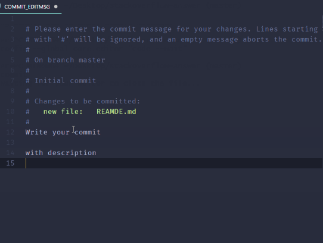

# Git e github
<!-- TOC -->
[Guida online dei comandi git](#guida-online-dei-comandi-git)  
[Best practice per i commit](#best-practice-per-i-commit)  
[Utilizzare VSCode come editor per i commit](#utilizzare-vscode-come-editor-per-i-commit)  
<!-- /TOC -->

## Guida online dei comandi git
>[Manuale di github](https://www.atlassian.com/it/git/glossary#commands)

## Best practice per i commit
>In [questa](https://gist.github.com/qoomon/5dfcdf8eec66a051ecd85625518cfd13) guida sono elencate le *best practice* per il corretto utilizzo dei messaggi di commit ([versione ita](https://github.com/RomuloOliveira/commit-messages-guide/blob/master/README_it-IT.md)).  

## Utilizzare VSCode come editor per i commit
> Per semplificare l'inserimento di un *messaggio* e di una *descrizione* di un **commit**, è molto più comodo utilizzare l'editor dei commit di VSCode.  

Procedura:  

1. Verifichiamo se il terminale prende il comando `code` digitando nel terminale:

```sh
    code --help     #visualizza la lista dei comandi
```

2. Nel caso non si riesca a visualizzare i comandi, dobbiamo aprire il menù di opzioni di VSCode digitando:
- su Mac `command` + `shift` + `p`
- su Windows `ctrl` + `shift` + `p`    

    Digitiamo "**Shell command: Install 'code' command in PATH**" in modo da installare il comando `code`.

3. Per abilitare l'editor VSCode ad accettare il comando di commit, inseriamo nel terminale il comando:

```sh
    git config --global core.editor "code --wait"
```

4. Da adesso possiamo lanciare i nostri commit senza l'opzione `-m`. Si aprirà in automatico l'editor dove potremmo inserire nella riga in basso il **messaggio** del commit e sotto di esso, lasciando una riga vuota, possiamo anche inserire una **descrizione**.

<details>
    <summary>click</summary>
    <div align="center"></div>
</details>