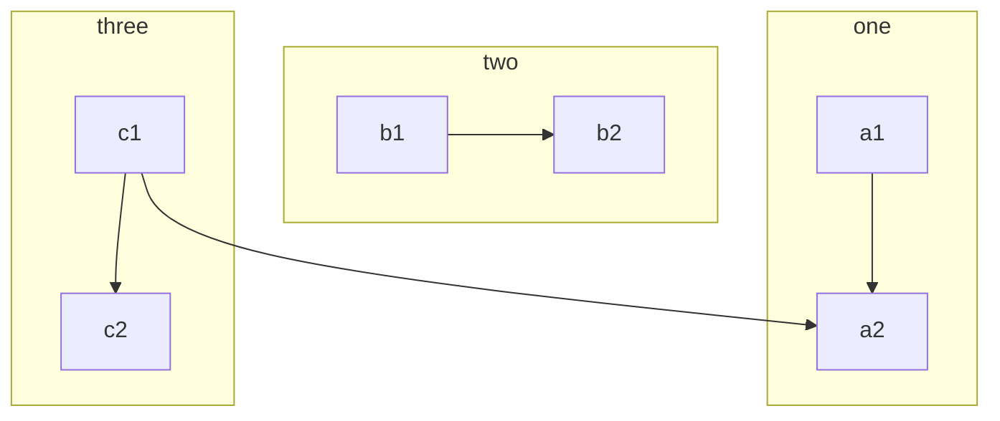
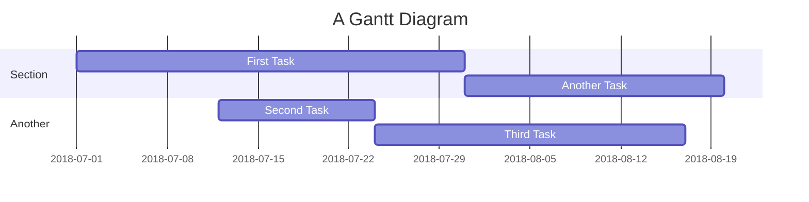

# Mini guida ai comandi Markdown

indice:  
<!-- TOC -->
[1. Guide dal web.](#1-guide-dal-web)  
[2. Invio a capo del testo.](#2-invio-a-capo-del-testo)  
[3. Usare il grassetto e il corsivo.](#3-usare-il-grassetto-e-il-corsivo)  
[4. Nascondere il codice (collapse).](#4-nascondere-il-codice-collapse)  
[5. Gestione del font con sintassi LaTex (stile e colore).](#5-gestione-del-carattere-con-la-sintassi-latex-stile-e-colore)  
[6. Inserire i **link** come una descrizione.](#6-inserire-i-link-come-una-descrizione)  
[7. Utilizzare i toc per creare un indice cliccabile.](#7-utilizzare-i-toc-per-creare-un-indice-cliccabile)  
[8. Lista emoji](#8-lista-emoji)  
[9. Grafici Mermaid](#9-grafici-mermaid)  

<!-- /TOC -->

## 1. Guide dal web

<details>
    <summary>link di rifertimento</summary>

- [guida semplice](https://www.ionos.it/digitalguide/siti-web/programmazione-del-sito-web/markdown/)<br>
- [altra guida semplice](http://elearning.lngs.infn.it/help.php?file=advanced_markdown.html)<br>  
- [guida html.it](https://www.html.it/articoli/markdown-guida-al-linguaggio)<br> 
- [guida adobe avanzata](https://experienceleague.adobe.com/docs/contributor/contributor-guide/writing-essentials/markdown.html?lang=it)<br>
- [altra guida avanzata](https://daringfireball.net/projects/markdown/syntax)
- [collapse del testo](https://gist.github.com/pierrejoubert73/902cc94d79424356a8d20be2b382e1ab)<br>
- [cambiare il colore](https://www.puntoinformaticofree.it/markdown_tutorial/markdown-9/markdown-15/)<br>

</details>

## 2. Invio a capo del testo.
Non si può utilizzare il tasto `Enter` per andare a capo di una riga.  
Si deve utilizzare il 'doppio spazio' da tastiera oppure il tag `<br>`.

## 3. Usare il grassetto e il corsivo. 
Inserire prima e dopo la parola/frase da modificare:  
Utilizzare il carattere `*` oppure `\` per il *corsivo*.  
Utilizzare il carattere `**` oppure `\\` per il **grassetto**.   
Utilizzare il carattere `***` oppure `\\\` per il ***corsivo-grassetto***.

esempio:

```md
Una parola in *corsivo*, oppure _corsivo_
un'altra in **grasseto**, oppure __grassetto__
un'altra in ***corsivo grassetto***, oppure ___corsivo grassetto___

```

## 4. Nascondere il codice (collapse).

```md
<details>
    <summary> titolo </summary>
    Contenuto  
</details>
```

<details>
    <summary> esempio </summary>

 ```c#
    Console.WriteLine("Ciao");
 ```
</details>

## 5. Gestione del carattere con la sintassi LaTeX (stile e colore).
Utilizzare la sitassi [**LaTex**](https://gist.github.com/luigiMinardi/4574708d404cdf4fe0da7ac6fe2314db#file-tex-colors-md).  

### Stile del carattere

Utilizza `\text` per cambiare lo stile del carattere:  

|suffix |   syntax  |          command           |          result         |
| ---   |    ---    |            ---             |           ---           |
|`none` |  `\text`  |  `$\text{ciao a tutti!}$`  | $\text{ciao a tutti!}$  |
|`\rm`  | `\textrm` | `$\textrm{ciao a tutti!}$` | $\textrm{ciao a tutti!}$|
|`\sf`  | `\textsf` | `$\textsf{ciao a tutti!}$` | $\textsf{ciao a tutti!}$|
|`\bf`  | `\textbf` | `$\textbf{ciao a tutti!}$` | $\textbf{ciao a tutti!}$|
|`\up`  | `\textup` | `$\textup{ciao a tutti!}$` | $\textup{ciao a tutti!}$|
|`\tt`  | `\texttt` | `$\texttt{ciao a tutti!}$` | $\texttt{ciao a tutti!}$|
|`\it`  | `\textit` | `$\textit{ciao a tutti!}$` | $\textit{ciao a tutti!}$|

### Colori
Per utilizzare i colori utilizza `\color` o `\textcolor`:  

|                        command                           |                           result                        |
|                          ---                             |                            ---                          |
|`$\color{red}{\textsf{ciao a tutti!}}$`                   | $\color{red}{\textsf{ciao a tutti!}}$                   |
|`$\color{#f00}{\textsf{ciao a tutti!}}$`                  | $\color{#f00}{\textsf{ciao a tutti!}}$                  |
|`$\textcolor{red}{\textsf{ciao a tutti!}}$`               | $\textcolor{red}{\textsf{ciao a tutti!}}$               |

**Deprecato:**  

    Utilizzare il tag html '*font color*' e il colore scelto.

    esempio

    ```md
    Una parola di colore <font color="red">rosso</font>
    ```

## 6. Inserire i link come una descrizione
Utilizzare la sintassi `[descrizione](link)`

esempio:

```md
il link normale è https://www.puntoinformaticofree.it/markdown_tutorial/
il link con descrizione è [descrizione](https://www.puntoinformaticofree.it/markdown_tutorial/)
```

## 7. Utilizzare i toc per creare un indice cliccabile.
Utilizzando la sintassi `[titolo](#riferimento-al-titolo-nel-file)` possiamo creare un indice cliccabile. In questo modo possiamo accedere direttamente alla sezione desiderata (come in questo stesso file.md).  
Per poter referenziare una parte del testo dobbiamo utilizzare il carattere `#` nelle parentesi e selezionare la sezione corretta.  
Nota che la sezione di destinazione deve iniziare a partire da un **titolo** che si crea sempre con il carattere `#`.

esempio:

```md
<!-- inizio dei TOC -->
[Titolo che può essere anche di tipo elenco numerato o puntato](#titolo-della-sezione-da-referenziare)
[Un altro titolo](#secondo-titolo-della-sezione-da-referenziare)
<!-- /fine dei toc -->

# Titolo della sezione da referenziare
Contenuto della sezione

## Secondo titolo della sezione da referenziare
Altro contenuto
.....
```

## 8. Lista emoji 
Per utilizzare le emoji nel file.md utilizzare il carattere `:` inserendolo prima e dopo il nome dell'emoji `:nome-emoji:`.  
Ecco un [elenco delle emoji](https://github.com/ikatyang/emoji-cheat-sheet/blob/master/README.md#smileys--emotion).    

> [!TIP]  
> Utilizza l'editor di github per visualizzare le emoji in tempo reale

## 9. Grafici Mermaid
Per creare grafici e diagrammi nella documentazione, utilizzare il codice *Mermaid*.  
Segui la guida a questo [link](https://jojozhuang.github.io/tutorial/mermaid-cheat-sheet/).  

esempio:



esempio:


